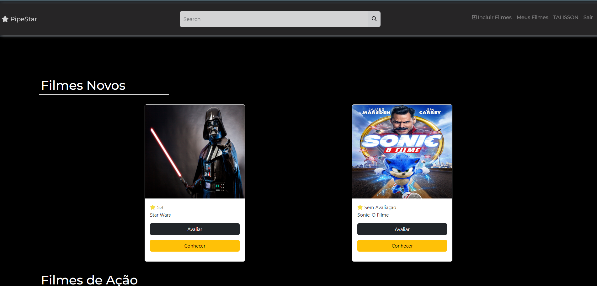
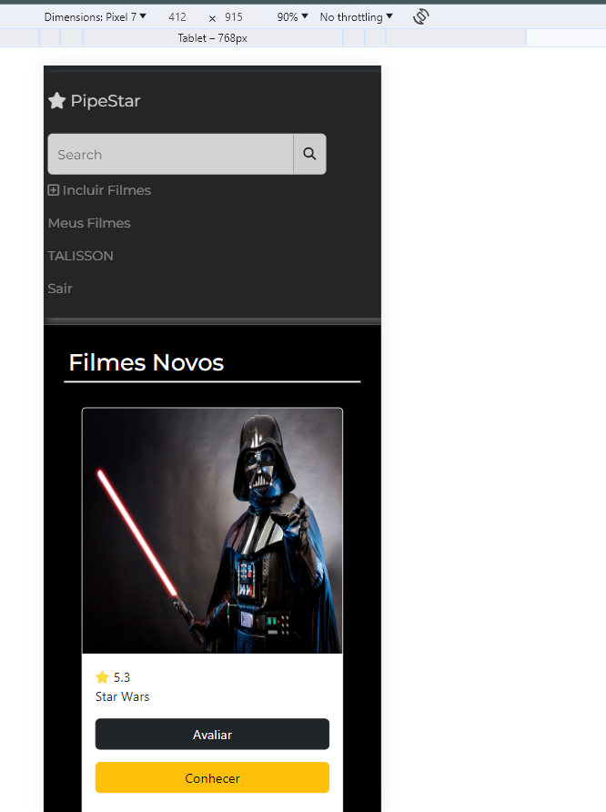

# Cartaz de Filmes

O Sistema de Cartaz de Filme desenvolvido em PHP é uma solução robusta e flexível para a criação eficiente de cartazes cinematográficos online. Combinando a potência do PHP com recursos avançados de design, este sistema oferece uma abordagem acessível e prática para produtores de cinema, estúdios e profissionais de marketing que buscam personalização e controle sobre a apresentação visual de suas produções.

## Variáveis de Ambiente

Para rodar esse projeto, você vai precisar ativa as seguintes lib no php.ini

`extension=gb`

`extension=PDO_MYSQL`

## Servidor
Xampp ou WampServer

## Modelagem

## Interface do sistema

Responsivel

